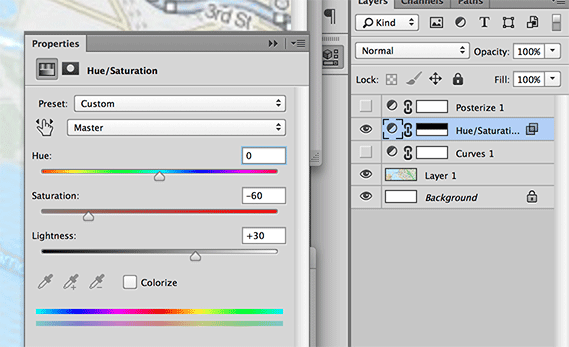

ColorCheat
==========

ColorCheat does simple color transformations by way of a mapping file. It lets
you define your color transformations in a program like Photoshop or Gimp, and
apply those transformations to new images by way of an RGB map.


Use
---

1. Generate a fresh RGB map file:
   
   ```
   $ python make-image.py map.png
   ```

2. Open `map.png` in Photoshop, and apply your color transformations as
   adjustment layers:

   
   
   Save map.png.

3. Apply the transformation to a new image:
   
   ```
   $ python apply-image.py photo.jpg map.png result.jpg
   ```
